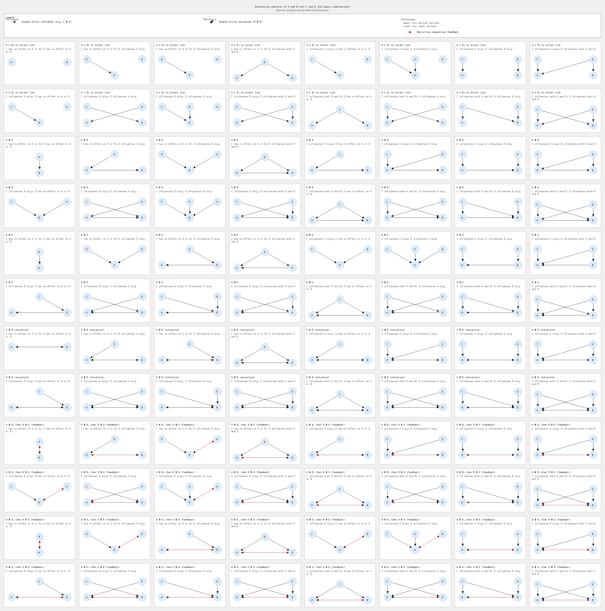

# Interaction Patterns

This project generates a comprehensive visualization of all possible interaction patterns between four entities: A, B, C, and D. It's a tool for exploring and understanding the complexities of system dynamics.

## Why is this important?

In any system with multiple components, the relationships between those components can be surprisingly complex. This tool systematically generates and displays every possible combination of influences, making it easier to:

*   **Identify hidden dependencies:** You might discover indirect relationships you hadn't considered.
*   **Analyze potential failure points:** See how the failure of one component could cascade through the system.
*   **Communicate complex ideas:** The visualization provides a clear and unambiguous way to discuss the structure of a system.

## The Scenarios

The generated image, `interactions.png`, shows a grid of 64 scenarios. Each scenario represents a unique combination of relationships:

*   **A and B:** Can have no direct link, a one-way influence (A → B or B → A), or a mutualistic relationship (A ↔ B).
*   **C and D:** Can influence A, B, both, or neither.

## License

This project is in the public domain. We waive copyright and related rights in the work worldwide through the CC0 1.0 Universal public domain dedication.

You can copy, modify, distribute and perform the work, even for commercial purposes, all without asking permission.
