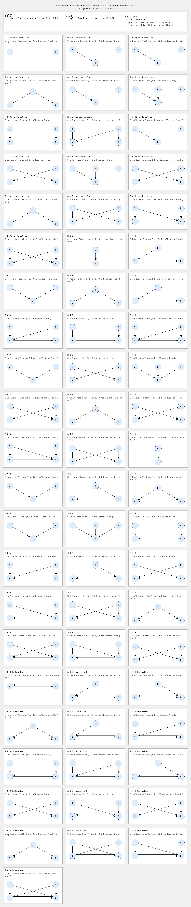

# Interaction Patterns

This project generates a comprehensive visualization of interaction patterns to demonstrate how quickly complexity can arise in a system. It uses a simple four-entity model (named A, B, C, and D) to systematically map out every possible relationship, serving as a tool for exploring and understanding the nature of system dynamics.

## Why is this important?

In any system with multiple components, the relationships between them can become surprisingly complex. This tool demonstrates this principle by systematically generating and displaying every possible combination of influences in a small model, making it easier to:

*   **Appreciate combinatorial complexity:** See how a few simple rules can generate a large number of unique states.
*   **Identify hidden dependencies:** Understand how indirect relationships can form.
*   **Communicate complex ideas:** The visualization provides a clear and unambiguous way to discuss the structure and potential complexity of any system.

## The Scenarios

The generated image, `interactions.png`, shows a grid of 64 scenarios based on a simple model:

*   Two primary entities (**A** and **B**) can have a range of relationships: no direct link, a one-way influence, or a mutualistic connection.
*   Two external entities (**C** and **D**) can influence the primary entities in various ways.

While the model is simple, it exhaustively maps every combination of these relationships to reveal the combinatorial explosion of complexity.



The long-form view above uses three columns so it remains readable within the GitHub README. The default eight-column grid is still rendered to `interactions.png` for full-width contexts.

## Command-line usage

The generator now offers subcommands so you can choose how you want to work with the scenarios. Run `go run main.go help` for a concise overview, or use the following cheatsheet:

* `render` — Create the visualization PNG. Use `--output` to set a custom destination (defaults to `interactions.png`). Add `--columns 3` when you need a long-form layout that reads well in narrow views like the GitHub README.
* `list` — Print the scenario titles to the console. Add `--long` to include subtitles for a quick narrative reference.

### Long-form examples

Render the grid to a specific location:

```
go run main.go render --output build/interaction-grid.png
```

Create a long-form version that fits narrower documentation columns (3 panels wide):

```
go run main.go render --columns 3 --output build/interaction-grid-long.png
```

Browse the scenarios directly in your terminal with subtitles for README or documentation work:

```
go run main.go list --long
```

## License

This project is in the public domain. We waive copyright and related rights in the work worldwide through the CC0 1.0 Universal public domain dedication.

You can copy, modify, distribute and perform the work, even for commercial purposes, all without asking permission.
